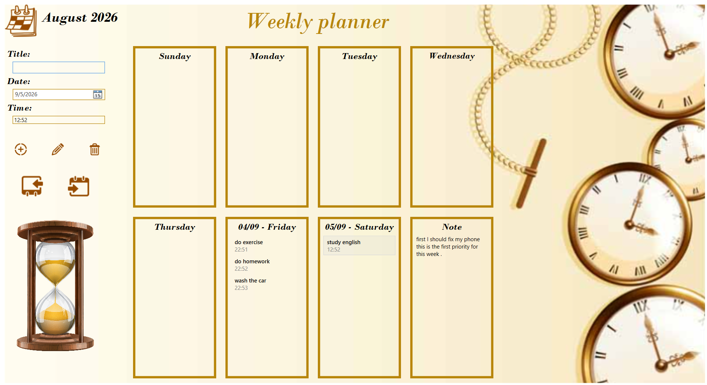

# 📅 Weekly Planner

A C# WPF desktop application for managing weekly events, schedules, and notes.

---

## 📸 Screenshots

### Weekly Planner



> The screenshot above shows the weekly calendar interface, including scheduled events, date navigation, and event management controls.

---

## ✨ Features

* 📅 Weekly calendar view
* ➕ Add new events
* ✏️ Edit existing events
* 🗑️ Delete events
* ⏰ Schedule events with specific times
* 🔄 Navigate between previous and next weeks
* 📝 Store weekly notes
* 💾 Persistent local data storage using JSON
* 📊 Events organized by individual days
* 🖥️ Desktop graphical user interface using WPF

---

## 🖥️ Application Overview

The Weekly Planner provides a simple desktop interface for organizing events throughout the week.

Each week is displayed as seven separate days, allowing users to quickly view scheduled events and their times.

Users can:

1. Select a date.
2. Enter an event title.
3. Specify the event time.
4. Add the event to the weekly schedule.
5. Select an existing event to edit or delete it.
6. Navigate between different weeks.

---

## 🛠️ Technologies

* **C#**
* **.NET 8**
* **WPF (Windows Presentation Foundation)**
* **MVVM Architecture**
* **XAML**
* **JSON**
* **Newtonsoft.Json**
* **Visual Studio**

---

## 📂 Project Structure

```text
weekly-planner-wpf/
│
├── Calender/
│   ├── App.xaml
│   ├── App.xaml.cs
│   │
│   ├── MainWindow.xaml
│   ├── MainWindow.xaml.cs
│   │
│   ├── MyModels/
│   │   ├── roeedad.cs
│   │   └── timeofroeedad.cs
│   │
│   ├── Mydata/
│   │   ├── handeldata.cs
│   │   └── handelnote.cs
│   │
│   ├── Myviewmodels/
│   │   └── barnamerizi.cs
│   │
│   ├── Images/
│   │   ├── add-32.png
│   │   ├── back5.png
│   │   ├── calendar-64.png
│   │   ├── clock.png
│   │   ├── date-to-48.png
│   │   ├── delete-32.png
│   │   ├── edit-32.png
│   │   └── lastweek.png
│   │
│   ├── dataroeedad.json
│   └── Ap_project.csproj
│
├── assets/
│   └── screenshot.png
│
└── README.md
```

---

## 🧩 Architecture

The project separates the main application responsibilities into different components:

### Models

The `MyModels` directory contains the data models used by the application.

The main event model contains information such as:

* Event ID
* Event title
* Start date and time
* Event duration

### Data Layer

The `Mydata` directory handles persistent data storage.

It is responsible for:

* Reading events from JSON
* Saving events to JSON
* Reading weekly notes
* Saving weekly notes

### ViewModel

The `Myviewmodels` directory contains the main scheduling logic.

The `barnamerizi` class handles operations such as:

* Adding events
* Editing events
* Deleting events
* Loading weekly events
* Navigating between weeks
* Sorting events by time
* Managing selected events

### View

The WPF interface is implemented using:

* `MainWindow.xaml`
* `MainWindow.xaml.cs`

The XAML file defines the graphical interface while the code-behind handles UI-specific interactions.

> The project uses a ViewModel-based structure, but it is not a strict full-MVVM implementation because some UI event handling remains in `MainWindow.xaml.cs`.

---

## 📆 Weekly Calendar

Events are organized into seven collections representing the days of the selected week:

```text
Sunday
Monday
Tuesday
Wednesday
Thursday
Friday
Saturday
```

When a week is displayed, the application:

1. Determines the start of the selected week.
2. Calculates the seven days of that week.
3. Filters events belonging to those dates.
4. Groups events by day.
5. Sorts events according to their time.
6. Displays them in the corresponding day.

---

## ➕ Event Management

### Add Event

Users can create a new event by entering:

* Event title
* Date
* Time

The event is then added to the weekly schedule and stored in the JSON data file.

### ✏️ Edit Event

An existing event can be selected from the weekly calendar.

Its information is loaded into the input fields, allowing the user to modify:

* Title
* Date
* Time

### 🗑️ Delete Event

A selected event can be removed from the schedule.

After deletion, the updated event collection is saved to the JSON file.

---

## ⏰ Time Management

Events contain a start date and time.

The application displays event times in a readable format such as:

```text
09:30
14:00
18:45
```

Events within each day are ordered according to their scheduled time.

---

## 🔄 Week Navigation

The application provides controls for navigating through the calendar.

Users can move:

* ⬅️ To the previous week
* ➡️ To the next week

When navigating to another week, the application refreshes the displayed events automatically.

---

## 💾 Data Persistence

The application uses JSON files for local data persistence.

### Events

Event information is stored in:

```text
dataroeedad.json
```

Example:

```json
[
  {
    "Id": 1,
    "Title": "Dentist Appointment",
    "StartDateTimeUtc": "2024-06-12T09:30:00Z",
    "DurationMinutes": 180
  },
  {
    "Id": 2,
    "Title": "Advanced Programming Class",
    "StartDateTimeUtc": "2024-06-15T14:00:00Z",
    "DurationMinutes": 180
  }
]
```

### Notes

Weekly notes are stored separately in:

```text
note.json
```

The notes are associated with the corresponding week's start date.

---

## 🔁 Application Workflow

```text
             ┌──────────────────┐
             │   Start Program  │
             └────────┬─────────┘
                      │
                      ▼
             ┌──────────────────┐
             │ Load JSON Data   │
             └────────┬─────────┘
                      │
                      ▼
             ┌──────────────────┐
             │ Calculate Week   │
             └────────┬─────────┘
                      │
                      ▼
             ┌──────────────────┐
             │ Display Events   │
             └────────┬─────────┘
                      │
          ┌───────────┼───────────┐
          ▼           ▼           ▼
       Add Event   Edit Event  Delete Event
          │           │           │
          └───────────┼───────────┘
                      ▼
             ┌──────────────────┐
             │ Save JSON Data   │
             └──────────────────┘
```

---

## 🚀 Getting Started

### 1. Clone the Repository

```bash
git clone https://github.com/alimhmdabesi/weekly-planner-wpf.git
cd weekly-planner-wpf
```

### 2. Open the Project

Open the solution file:

```text
Ap_project.sln
```

using **Visual Studio**.

### 3. Restore Dependencies

Visual Studio should automatically restore the required NuGet packages.

The project uses:

```text
Newtonsoft.Json 13.0.3
```

### 4. Build the Project

From Visual Studio:

```text
Build → Build Solution
```

or use:

```bash
dotnet build
```

### 5. Run the Application

Run the project from Visual Studio or execute:

```bash
dotnet run
```

> This project targets Windows because it uses WPF.

---

## 📋 Example Usage

After launching the application:

### Create an Event

Enter:

```text
Title: Dentist Appointment
Date: 2024-06-12
Time: 09:30
```

Then click **Add**.

The event will appear under the corresponding day.

### Edit an Event

1. Select an existing event.
2. Modify its information.
3. Click **Edit**.

### Delete an Event

1. Select an existing event.
2. Click **Delete**.

### Navigate Weeks

Use the previous and next week buttons to move through the calendar.

---

## 🎯 Project Goals

This project was developed to practice and demonstrate:

* C# desktop application development
* WPF and XAML
* Object-oriented programming
* Event-driven programming
* Data binding
* Observable collections
* JSON serialization and deserialization
* Local data persistence
* Basic ViewModel architecture
* Date and time manipulation
* Weekly scheduling logic

---